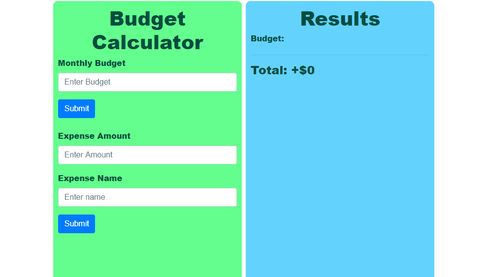

# Budget-Tracker
This is a budget tracker made in Javascript which saves to local storage. You can add a budget or expenses, as well as
deleting or updating them. 

# Showcase: 
Here is a short GIF of the project; it's also available here: https://viktorbash.github.io/Budget-Tracker/

